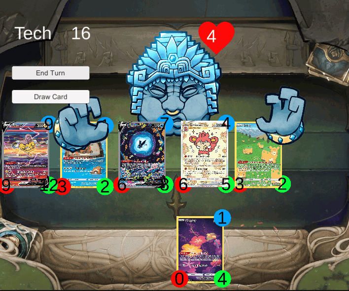
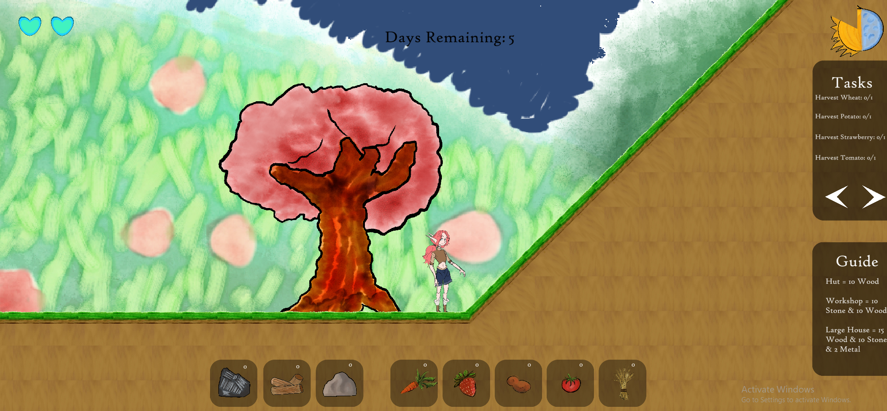

# Gameplay Programmer

#### Technical Skills: C#, C++, Python, Unity, Adobe Photoshop, Version Control

## Education
Moorpark College ~ 2021 - Current

## Work Experience
- DarkBurn Interactive - Gameplay Capture Artist ~ 2023 - Current
- Mind Factory Studios - Contract Programmer, Programming Consultant ~ 2023 - Current
  
## Internship
- Moorpark College - Programming Student Teacher - unity, C#, version control ~ 2023 - Current

## Projects

### Boxed In
#### Gameplay/Systems programmer
<!--insert image/videos here-->
<iframe frameborder="0" src="https://itch.io/embed/2075813" width="552" height="167"><a href="https://heroshrine.itch.io/boxed-in">Boxed In by Heroshrine, ImCrowley, batmanlm_8</a></iframe>

Boxed In is a 3D platformer vertical slice about a cat escaping the twisted science expiriments of his handler, Dr.Schrodinger.

Developed in 4 months as a part of my game technologies 2 class, boxed in was developed by a team of 10 students, 2 programmers (including myself), 4 artists, and 4 designers.

During my time working on Boxed In I worked on such mechanics as climbing, patroling robots, ui functionality and various tools for the development team.

### Galaxy Divided
#### Lead Gameplay Programmer/Producer
<!--insert image/videos here-->
Galaxy Divided is a 3rd person 3D shooter taking place on an alien planet as you fight off a corrupt government. Using rouge like elements

Developed over 4 months as a part of my capstone Game Design Studio project with a development team of 15 people.

Lead programmer as well as stepping into a producer role for the last 2 months of the project.

Developed a robust shop system, Advanced player movement mechanics, weapon and item systems, and Code refactoring.

### Prototype digital card game

This project was a digital card game developed as apart of my school sanctioned game design intership with my professor Johnathan Bair with the overall goal of expanding my programming skillset and producing a vertical slice proof of concept.

For this project I developed a flexible card abstract class system to streamline new card implementations

I also created light rouge-lite elements with a interactive boss enemy using vector math and the unity animator.

### World War Zoo
#### Gameplay Programmer

<iframe frameborder="0" src="https://itch.io/embed/2160330" width="552" height="167"><a href="https://heroshrine.itch.io/world-war-zoo">World War Zoo by Heroshrine, DocDankDandy, batmanlm_8, Bluevoker, MayoMiu, vanipurin</a></iframe>

World War Zoo is a 3D isometric tower offense game where you play as an omnipotent being sending cryptid to defend the local forest and wilderness against urbanization efforts.

Developed in a team of 8 over 48 hours for the 2023 GMTK gamejam with the theme of Roles Reversed.

As a core gameplay programmer I was focused on developing systems relating to player units, enemy towers, and other core systems.

### Aila

#### Gameplay/Systems Programmer

Alia was a 2D farming and resource managment game built over 3 weeks for my Game Technology 1 class

Developed in a team of 5 with a striking visual style and impressive atmosphere

Apart of this project I worked on everything from basic movement, resource collections, building, general systems, and team wide development tools.
